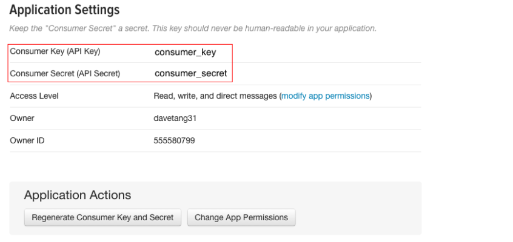

In this document, we will experiment with the _TwitteR_-package of R. We will crawl Twitter and extract some basic data. Install the _TwitteR_-package if not installed and load it.


BLABLA ON HOW TO GENERATE BLALBAL CURL PACKAGE

First, one has to log in into Twitter (or create an account) and then go to the [_Twitter Application Management_](https://aps.twitter.com). Here, click on _Create New APP_, fill out the form and especially fill in the field *Callback URL* with http://127.0.0.1:1410/. Then, retrieve the _Consumer Key_ and the _Consumer Secret_ in order to configure R properly.



Setting up the _Twitter OAuth_ authentication can be hard, but this setup should work. We specify the _Consumer Key_ and the _Consumer Secret_ and parse it to _setup\_twitter\_oath_. After this command, the browser will open for authentication. After this is completed, we can start with submitting our own queries.

```{r, cache=TRUE}

require(twitteR)

consumer_key <- 'zFnNG5TMJ1jBlUh7ENKjAxTCa'
consumer_secret <- 'hK6wd2w2zWATEWrmor0brVeSd9jID3YYhmLSnVmj8lp1MErs53'

setup_twitter_oauth(consumer_key,
                    consumer_secret)

r_stats <- searchTwitter('#itsacoup',n=1000)
```
```{r, cache=TRUE}
require(igraph)
user <- getUser('ETHZSystDesign')
friends <- user$getFriends()
followers <- user$getFollowers()
network <-graph.empty(n=0, directed=TRUE)
network <- network + user$screenName

for (i in 1:length(followers)){
network <- network +followers[[i]]$screenName
network[i+1,1]<-1
  #piet <-followers[[i]]
#  friendframe[i,] <- piet$screenName
  }
for (i in 1:length(friends)){
  #print(friends[[i]]$screenName)
  if (sum(V(network)$name==friends[[i]]$screenName)){
    network[user$screenName,friends[[i]]$screenName] <- 1
    } else {
      network <- network + friends[[i]]$screenName
      network[user$screenName,friends[[i]]$screenName] <- 1
    }
}

plot(network,
     layout=layout.fruchterman.reingold,
     vertex.size=3,
     vertex.label.cex=.3,
     vertex.label.dist=.1,
     edge.width = 0.5,
     edge.arrow.width=0.5
     )
```
Note that the `echo = FALSE` parameter was added to the code chunk to prevent printing of the R code that generated the plot.
